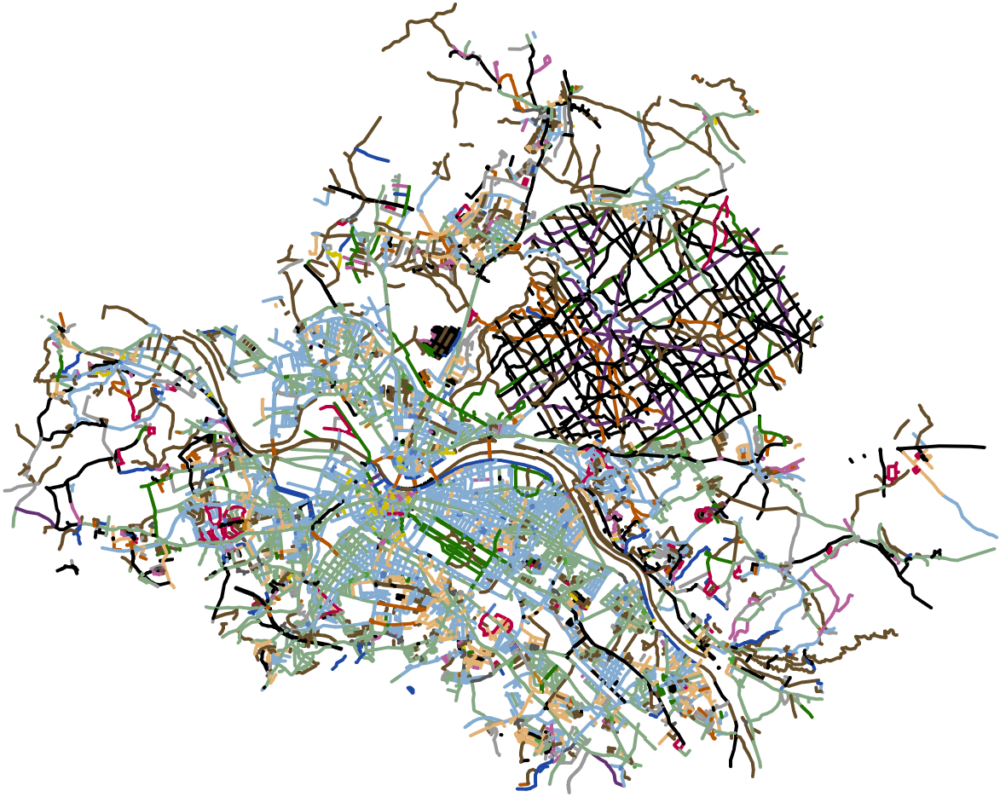

# Colorful Streets Map

## About
This interactive map overlay visualizes streets extracted from [OpenStreetMap](https://openstreetmap.org) (OSM) data. Coloring is done based on grouping common patterns in street names. The Web-based map is created using [OpenLayers](https://openlayers.org). Several pre-processing steps are recommended to increase the performance of data loading when create the map overlay.

Since street names, and thus street name patterns, are specific to the regional language and other cultural as well as geographical characteristics, the configuration of name patterns has to be tailored to the region of the used OSM data. The example data used here is tailored to OSM data of the city of [Dresden](https://en.wikipedia.org/wiki/Dresden), Germany. The following screenshot shows the visualization created by this project with Dresden OSM data input.



## Prerequisites, Configuration and Usage
The geographical region to be displayed has to be available as an [OSM XML](https://wiki.openstreetmap.org/wiki/OSM_XML) file. Place it somewhere in the project directory. You may configure the used filename, the map center coordinates fitting your region and the zoom level in the top part of the JavaScript file. Optionally, an OSM tile background can be displayed. Therefore, an opacity level is provided with a value between 0 (invisible) and 1 (fully visible).

The hardest, but most creative and rewarding, part is to set up [regular expressions](https://developer.mozilla.org/en-US/docs/Web/JavaScript/Guide/Regular_Expressions) matching the street names from the provided OSM data. Expressions and the assigned colors are configured in a map within the constructor of the JavaScript class `ColorfulStreetsMap`.

With the OSM data file and configuration set up, serve the directory as static content by a Web server and point your Web browser to `index.html`. After several seconds, depending on the amount of data to be processed, the map appears. It has panning and zooming capabilities.

## Obtaining OSM Data
First, OSM data has to be obtained for your desired region. Get it via the [OSM API](https://wiki.openstreetmap.org/wiki/API_v0.6#API_calls) with a bounding box specified. An example API call with a bounding box set within Dresden would be:

`https://api.openstreetmap.org/api/0.6/map?bbox=13.720,51.03,13.730,51.04`

Alternatively, pre-exported data can be used such as from [bbbike.org](https://download.bbbike.org/osm/bbbike/), which provides OSM data of more than 200 regions worldwide. The zipped file [Dresden.osm.gz](https://download.bbbike.org/osm/bbbike/Dresden/Dresden.osm.gz) has a current size of about 63 [MiB](https://en.wikipedia.org/wiki/Binary_prefix). The extracted size of this example OSM data is 442 MiB.

## Pre-processing Steps
Several steps can be done to reduce the OSM data file's size and therefore increase the processing performance.

Clipping the resulting data is done with a more accurate [shapefile](https://wiki.openstreetmap.org/wiki/Shapefiles) defining polygons, since the previously provided bounding box in the API call is only a rectangle. Pre-built shapefiles may be downloaded from [polygons.openstreetmap.fr](http://polygons.openstreetmap.fr) with the required `id` parameter, which is obtained from [nominatim.openstreetmap.org](https://nominatim.openstreetmap.org) by searching for your region or city (copy the numeric OSM relation id). The `id` of Dresden is `191645`. Assume, you have downloaded and saved the corresponding shapefile as `Dresden.poly`. Now, use the converting tool [osmconvert](https://wiki.openstreetmap.org/wiki/Osmconvert) to cut your data along the polygon:

```sh
osmconvert -B=Dresden.poly --complete-ways --drop-broken-refs --drop-author --drop-version Dresden.osm > Dresden-clipped.osm
```

Additional command line switches cut out unused metadata. The result size of the clipped OSM data is about 131 MiB.

[osmfilter](https://wiki.openstreetmap.org/wiki/DE:Osmfilter) is used as a tool to keep only streets using the key [highway](https://wiki.openstreetmap.org/wiki/Key:highway). The example command for the clipped file `Dresden-clipped.osm` serving as input with an output file size of about 30 MiB:

```sh
osmfilter --keep="highway=*" Dresden-clipped.osm > Dresden-clipped-highways.osm
```

The resulting OSM data could be reduced in size to less than 7 percent of the original export data. It can now be processed by the OpenLayers vector renderer provided by this Web application. The loading time is about 6 to 7 seconds. Of course, the described processing steps may reproduced for any region.
